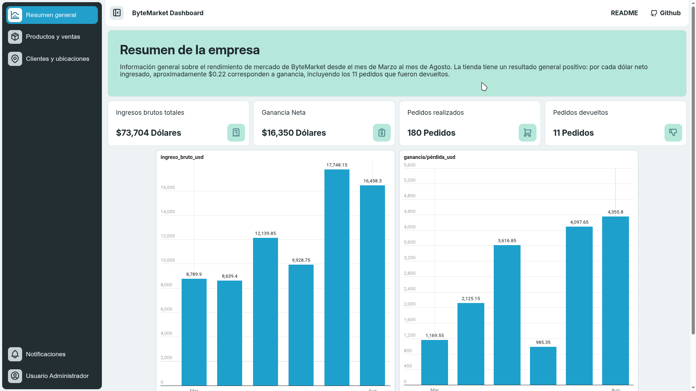
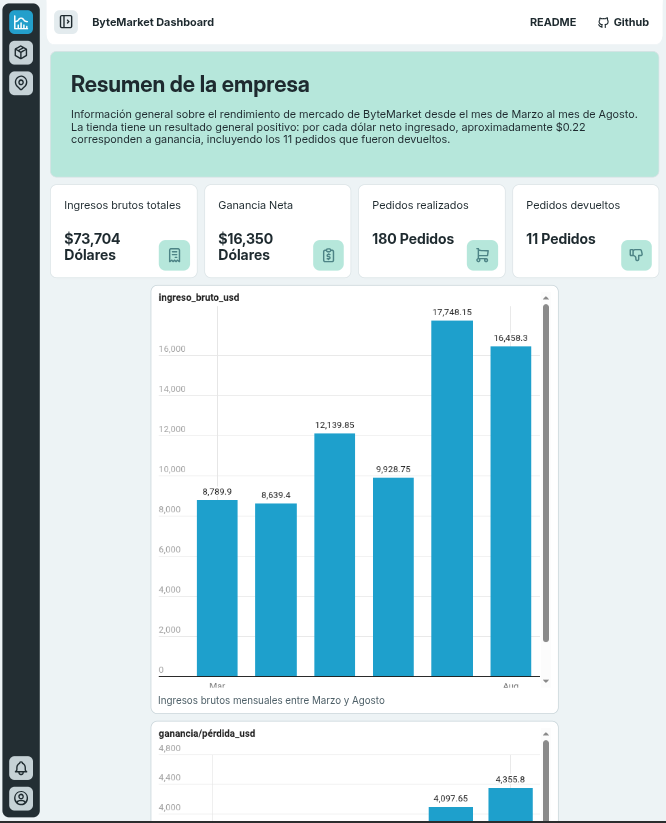
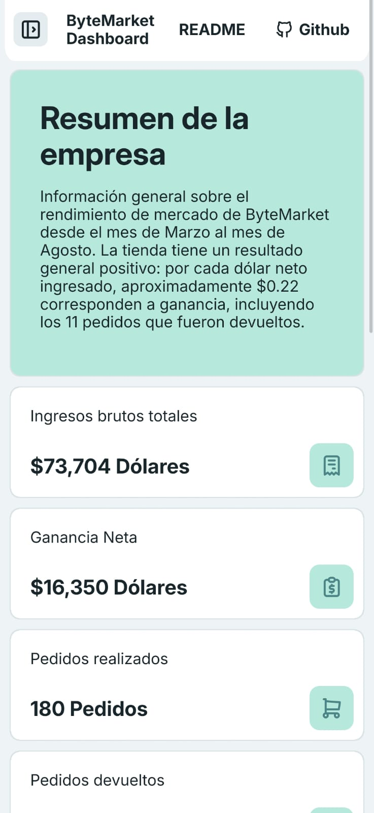

# Actividad para RA2 - CSS Flexbox y Grid: Dashboard Administrativo ByteMarket

## Tema de la página web
Un **Dashboard Administrativo** para un sistema de gestión de comercio electrónico (ByteMarket), orientado a la analítica de ventas, control de inventario y seguimiento de clientes.

# Actividad RA2 - Diseño de Interfaces con CSS Flexbox y Grid

Este repositorio contiene el código fuente y los recursos correspondientes al desarrollo de un panel de control administrativo (dashboard). El proyecto ha sido diseñado aplicando técnicas modernas de maquetación web con **CSS Grid**, **Media Queries** y **Flexbox**.

## Propósito de la Página Web
El objetivo principal de este proyecto es centralizar y visualizar de forma clara el rendimiento comercial de la empresa ficticia **ByteMarket** entre los meses de marzo y agosto. Permite al usuario supervisar métricas a través de tarjetas de resumen, gráficos y tablas de ingresos, productos, categorías y distribución de clientes.

## Cómo se aplicó la Semántica HTML5
Se emplearon etiquetas semánticas de HTML5:
* `<header>` (con `role="banner"`): Contiene la barra de navegación superior fija (`sticky`), el logotipo/marca del sistema y accesos directos al repositorio.
* `<aside>` (con `role="navigation"`): Funciona como la barra lateral colapsable para la navegación entre las secciones principales (Resumen, Productos y ventas, Clientes y ubicaciones) y accesos de usuario/notificaciones.
* `<main>` (con `role="main"`): Envuelve el bloque central y dinámico de contenido del dashboard.
* `<section>`: Utilizado para estructurar y aislar cada vista o bloque de información del sistema, alternando su visibilidad mediante JavaScript.
* `<figure>` y `<figcaption>`: Asociados para encapsular de manera semántica los gráficos y tablas embebidos mediante Datawrapper.
* `<footer>` (con `role="contentinfo"`): Aloja los datos de autoría académica y los enlaces de referencia al repositorio.

## Criterios de Accesibilidad Aplicados
El desarrollo priorizó el cumplimiento de buenas prácticas de accesibilidad web (A11y):
* **Atributos ARIA:** Se utilizaron roles explícitos (`role="banner"`, `role="navigation"`, `role="main"`, `role="contentinfo"`) para clarificar las regiones principales de la página a los lectores de pantalla.
* **Se ocultaron los elementos decorativos:** Todos los iconos vectoriales de Tabler Icons incorporan el atributo `aria-hidden="true"` para evitar ruidos innecesarios en tecnologías de asistencia.
* **Control de estados interactivos:** Uso de atributos como `aria-current="page"` para denotar visual y funcionalmente la sección activa dentro de la barra de navegación lateral.
* **Contraste y tipografía:** Definición de una paleta de colores centralizada en variables CSS (`:root`) que garantiza relaciones de contraste óptimas entre los textos y los fondos institucionales.
* **Diseño adaptativo (*Responsive Design*):** Implementación de *media queries* para garantizar una navegación fluida tanto en dispositivos de escritorio como en pantallas móviles y tablets.

## Tecnologías Usadas
* **HTML5:** Estructuración semántica y avanzada.
* **CSS3:** Maquetación con *CSS Grid* (`grid-template-areas`), *Flexbox*, variables personalizadas (*Custom Properties*) y transiciones.
* **JavaScript:** Control de interactividad para la animación, colapso y despliegue del menú lateral (`aside`).
* **Datawrapper:** Inserción de gráficos interactivos y tablas analíticas estructuradas.
* **Tabler Icons:** Librería de iconos vectoriales modernos.

## ¿Cómo visualizar la página?
La página se puede visualizar directamente mediante el servicio de [Github pages](https://ctrl-angelus.github.io/Actividad-para-RA2_CSS-Flexbox-y-Grid/) o clonando el repositorio y abriendo el archivo `index.html` en cualquier navegador web moderno. Dentro de la carpeta server/ hay un script de Python que usa livereload para hacer cambios al html en tiempo real, es para desarrollo nada más.

## Capturas de pantalla
Captura de pantalla en escritorio
<p align="center">
  
</p>
Captura de pantalla en tablet
<p align="center">
  
</p>
Captura de pantalla en móvil
<p align="center">
  
</p>


## Estructura del Proyecto
```text
/
├── index.html        
├── style.css        
├── index.js          
├── README.md         
└── server/           # Carpeta de Python con livereload
└── assets/           # Carpeta de capturas y fuentes

